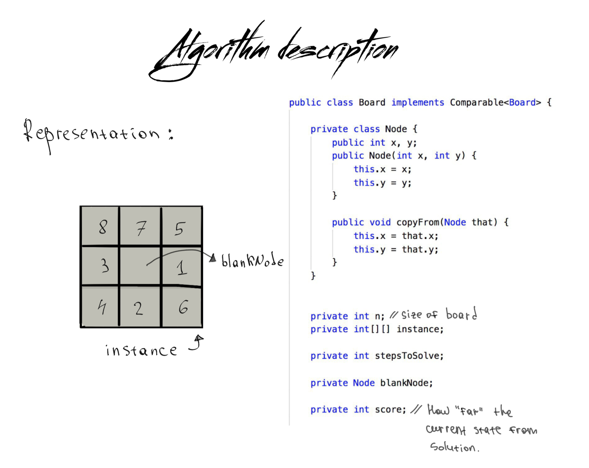
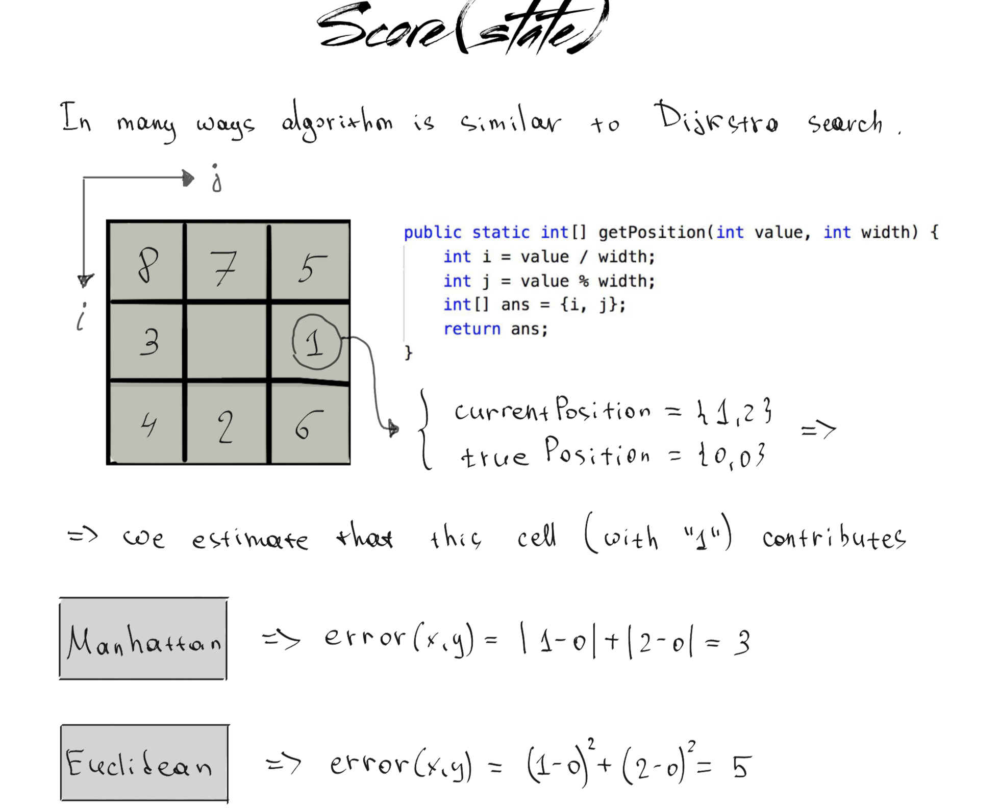
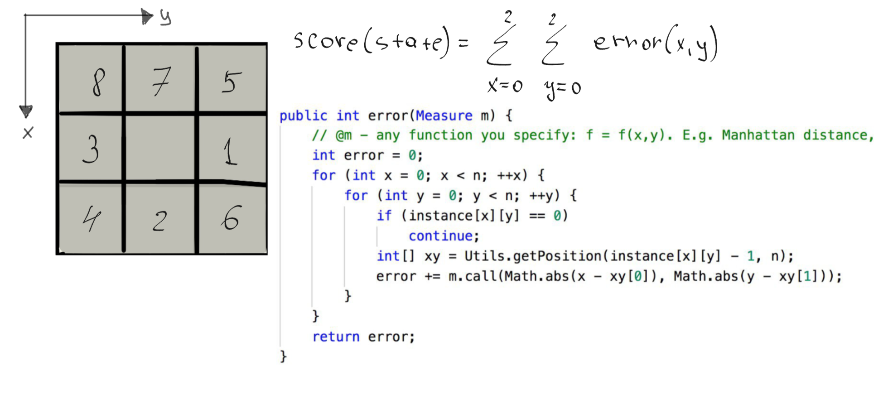

Below is the complete description of the algorithm _A star_ or _Smart Dijkstra_ to solve
"N-puzzle" problem. See [link](https://en.wikipedia.org/wiki/15_puzzle) for more details.

A* tries to approximate each state towards final configuration via so called heuristic function (in our example Manhattan distance and Euclidean).

*Error for a fixed cell*

*Total error for a state(board)*